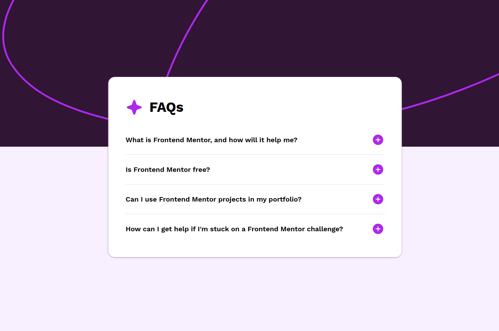
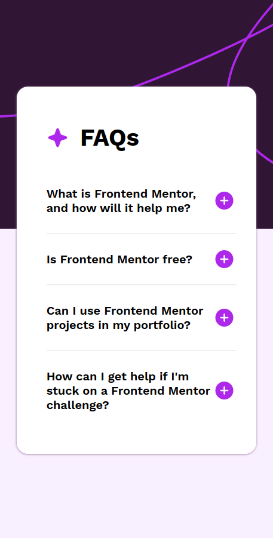

# Frontend Mentor - Blog preview card component solution

This is a solution to the [FAQ accordion challenge on Frontend Mentor](https://www.frontendmentor.io/challenges/faq-accordion-wyfFdeBwBz/hub).

[Live Demo](https://hokay-faq-accordion-component.netlify.app/)

## Screenshots

### Desktop

### Mobile

## Built with

- HTML
- CSS
- JavaScript

## Author

- Portfolio - [hakanokay.dev](https://hakanokay.dev/)
- Frontend Mentor - [@h-okay](https://www.frontendmentor.io/profile/h-okay)
